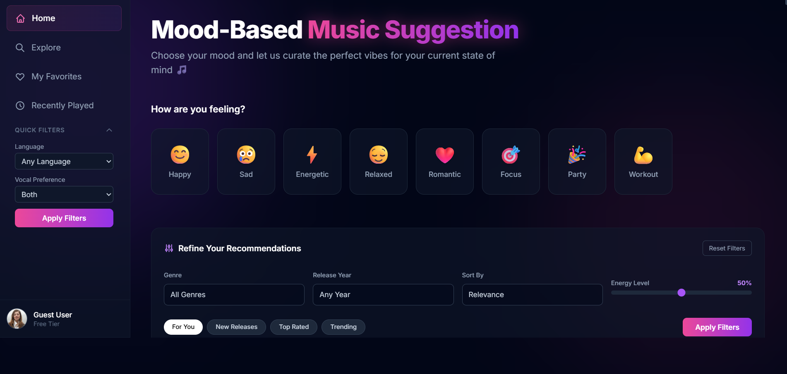
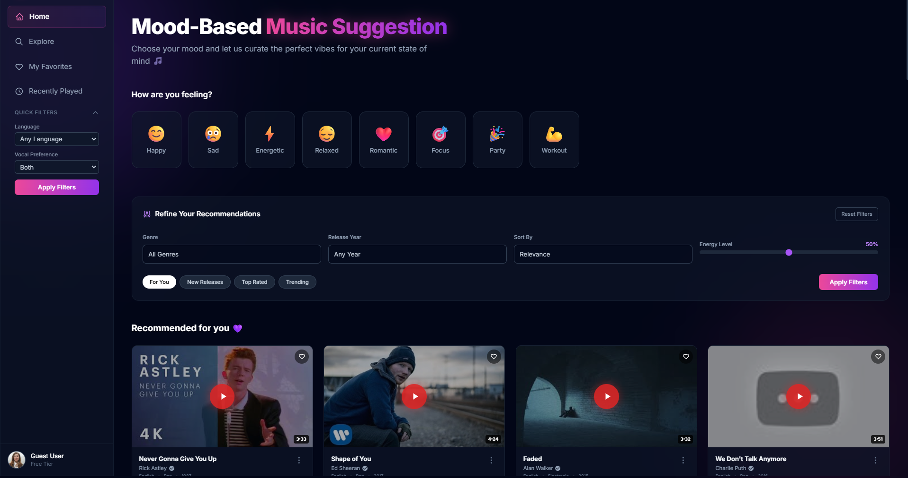
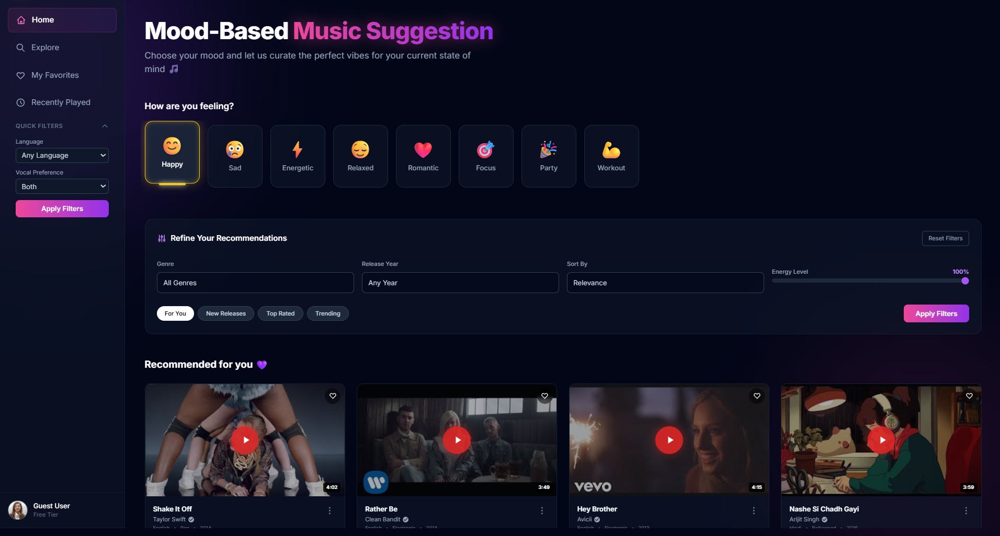
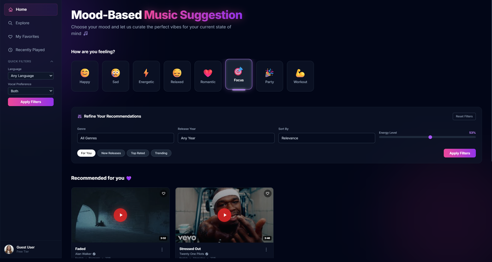
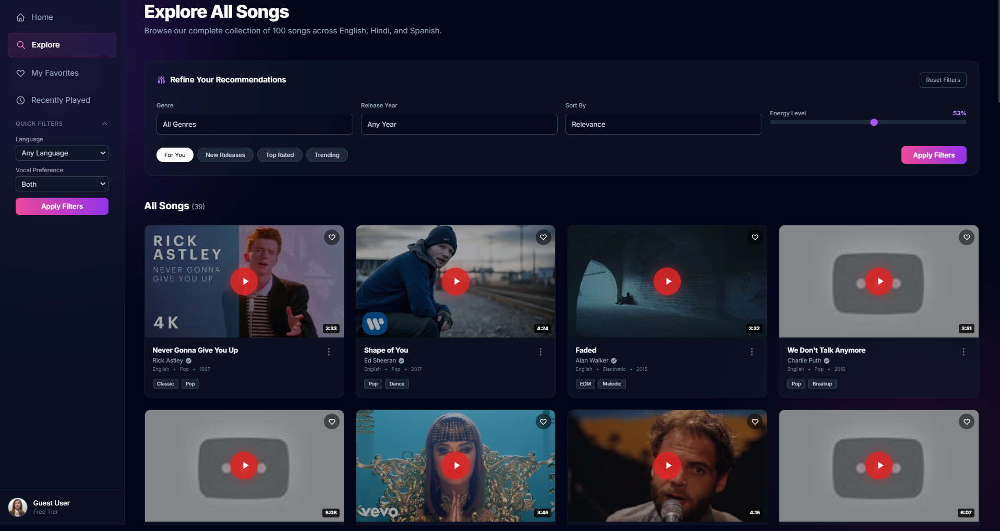
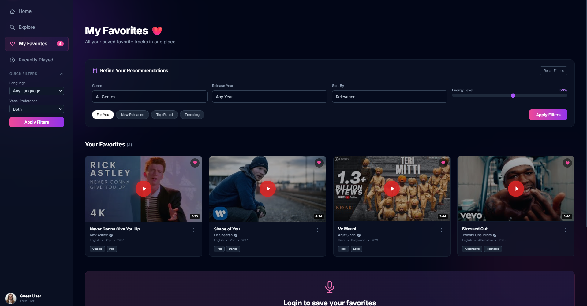
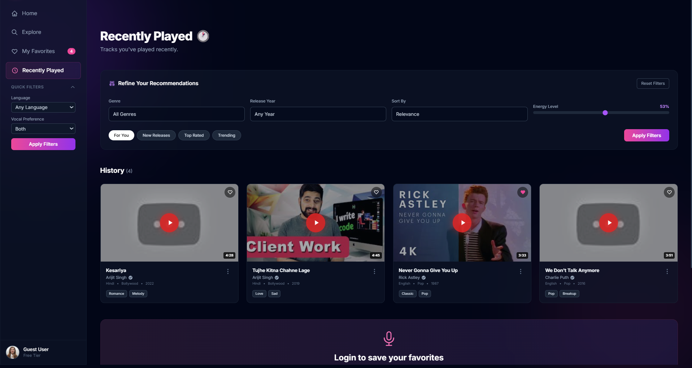
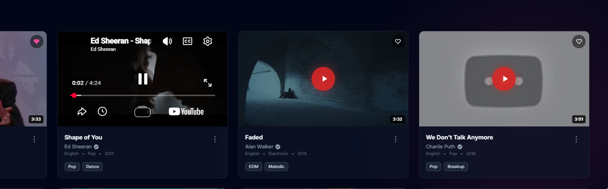

# 🎵 Moodify

**Mood-Based Music Discovery Platform**

A futuristic, glassmorphic web application that curates music recommendations based on your current mood. Built with Laravel Blade, Alpine.js, and Tailwind CSS.



---
### 🚀 Live Demo
[Click here to visit Moodify!](http://mood-music.test/?mood=happy#)

## 📸 Screenshots

### 🏠 Home Dashboard
The main landing page with mood selection, ambient glow effects, and personalized recommendations.



### 🎭 Mood Selection
Choose from 8 different moods to instantly filter songs that match your vibe.




### 🔍 Explore All Songs
Browse the complete collection of 100+ songs across three languages.



### ❤️ My Favorites
Your personally curated collection of saved tracks, persisted across sessions.



### 🕐 Recently Played
Automatic tracking of your listening history.



### 🎬 Video Playback
Inline YouTube embed with thumbnail preview and one-click play.



---

## ✨ Features

| Feature | Description |
|---------|-------------|
| **🎭 Mood Selection** | 8 moods: Happy, Sad, Energetic, Romantic, Focus, Party, Workout, Relaxed |
| **🌍 Multi-Language** | 100+ songs in **English**, **Hindi**, and **Spanish** |
| **❤️ Favorites** | Save songs with heart icon — persisted in `localStorage` |
| **🕐 Recently Played** | Auto-tracks listening history (last 50 songs) |
| **🔍 Smart Search** | Real-time search across titles, artists, genres, and tags |
| **🎛️ Advanced Filtering** | Genre, year, language, vocal type, and energy level sliders |
| **⚡ Quick Filters** | One-click: For You, New Releases, Top Rated, Trending |
| **📱 Responsive** | Mobile-first with collapsible sidebar |
| **🎨 Glassmorphic UI** | Dark theme with ambient glows, blur effects, and gradients |

---

## 🛠 Tech Stack

| Technology | Purpose |
|------------|---------|
| **Laravel** | Backend framework (Blade templating) |
| **Alpine.js** | Lightweight reactive JavaScript framework |
| **Tailwind CSS** | Utility-first CSS framework |
| **YouTube Embed API** | Video playback integration |

---

## 🚀 Getting Started

### Prerequisites
- PHP &gt;= 8.1
- Composer
- Node.js & NPM

### Installation

```bash
# Clone the repository
git clone https://github.com/YOUR_USERNAME/moodify.git
cd moodify

# Install PHP dependencies
composer install

# Install JavaScript dependencies
npm install

# Copy environment file
cp .env.example .env

# Generate application key
php artisan key:generate

# Start the development server
php artisan serve
```
## 🎶 Song Catalog

| Language     | Count | Genres                                                  |
| ------------ | ----- | ------------------------------------------------------- |
| 🇬🇧 English | 34    | Pop, Rock, Electronic, Hip Hop, R\&B, Alternative, Soul |
| 🇮🇳 Hindi   | 33    | Bollywood, Telugu, Folk, Pop                            |
| 🇪🇸 Spanish | 33    | Latin, Reggaeton, Pop, Salsa, Tropical                  |

## 🔐 Data Persistence
All user data is stored locally in the browser:

| Data            | Storage Key         | Max Items |
| --------------- | ------------------- | --------- |
| Favorites       | `moodify_favorites` | Unlimited |
| Recently Played | `moodify_recent`    | 50        |

## 🙏 Acknowledgments
[Laravel](https://laravel.com/) — The PHP framework for web artisans

[Alpine.js](https://alpinejs.dev/) — Rugged, minimal framework for composing JavaScript behavior

[Tailwind CSS](https://tailwindcss.com/) — Rapidly build modern websites without leaving your HTML

[YouTube](https://youtube.com/) — Video hosting and embed API
